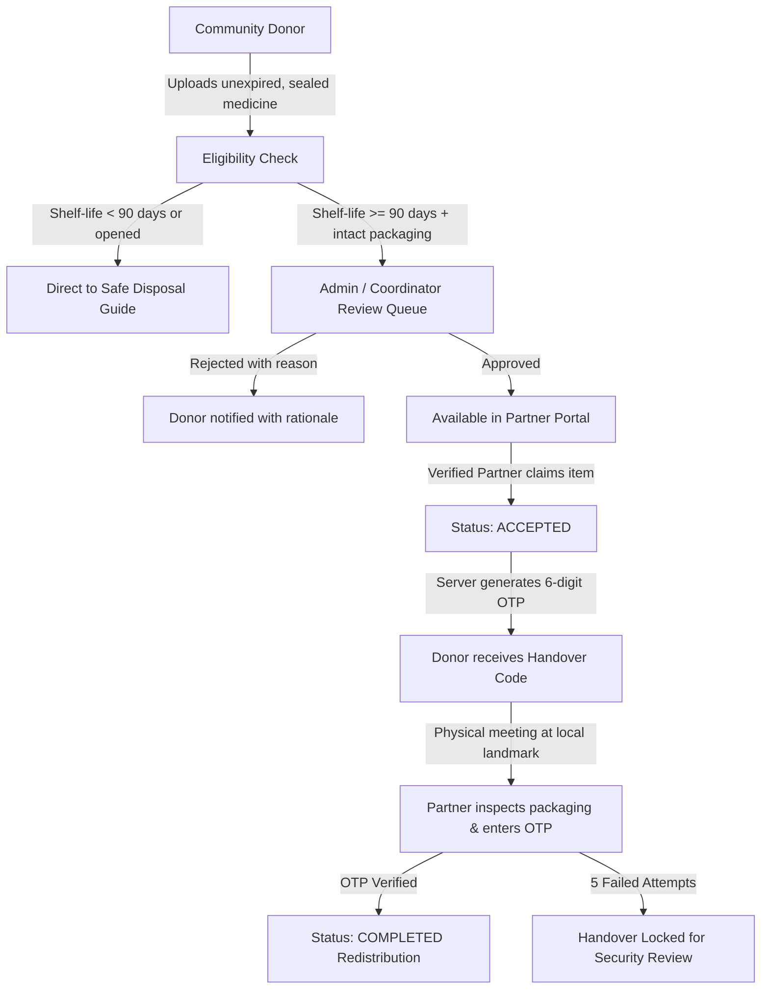
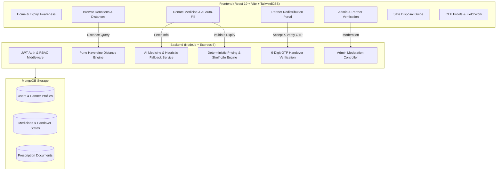

# MEDISAVE

> **Verified Community Medicine Donation & Expiry Awareness Platform**  
> *A community-driven digital platform designed for safe surplus medicine donation, verified redistribution to local clinics/NGOs, physical handover authentication, and safe disposal education.*  
> **Pune Institute of Computer Technology (PICT) — Community Engagement Project (CEP | Course Code: 0313201)**

---

## ⚠️ Academic & Community Engagement Notice
**MEDISAVE is an academic and community engagement prototype developed at PICT.** It is **not** a commercial online pharmacy, licensed pharmaceutical manufacturer, or logistics delivery company.

> **Important Limitation**: MEDISAVE is an academic prototype and does not itself authorize the sale, dispensing, or distribution of medicines. Real-world implementation would require appropriate regulatory, pharmacy, clinical and institutional approvals.

The platform facilitates structured surplus medicine donation drives, non-profit redistribution to verified community healthcare organizations, physical handover verification using one-time security codes, and environmental safe-disposal guidance for expired medications.

---

## 📋 Table of Contents
- [Problem Statement](#problem-statement)
- [The MEDISAVE Solution](#the-medisave-solution)
- [Core End-to-End Workflow](#core-end-to-end-workflow)
- [User Roles & Access Control](#user-roles--access-control)
- [Key Platform Modules](#key-platform-modules)
  - [1. Verified Donation & AI Assistant](#1-verified-donation--ai-assistant)
  - [2. Partner Redistribution Portal](#2-partner-redistribution-portal)
  - [3. 6-Digit Physical Handover Verification](#3-6-digit-physical-handover-verification)
  - [4. Safe Household Disposal Guide](#4-safe-household-disposal-guide)
  - [5. Coordinator & Admin Moderation](#5-coordinator--admin-moderation)
  - [6. CEP Field Activity & Proofs Portal](#6-cep-field-activity--proofs-portal)
- [Deterministic Proximity & Haversine Distance Engine](#deterministic-proximity--haversine-distance-engine)
- [Deterministic Fair Pricing & Zero-Profit Donation Policy](#deterministic-fair-pricing--zero-profit-donation-policy)
- [System Architecture](#system-architecture)
- [Technology Stack](#technology-stack)
- [Demo Accounts & Test Credentials](#demo-accounts--test-credentials)
- [Installation & Local Setup](#installation--local-setup)
- [Automated Testing & Verification Suite](#automated-testing--verification-suite)
- [PICT CEP Team Members](#pict-cep-team-members)
- [5–7 Minute Presentation Demo Script](#57-minute-presentation-demo-script)

---

## 🚨 Problem Statement
Substantial quantities of unexpired, sealed pharmaceutical medications are discarded annually by households due to recovery from acute illnesses, treatment plan adjustments, or accidental over-purchasing. Simultaneously, low-income families, orphanages, and charitable health camps face acute shortages of common essential medications.

1. **Pharmaceutical Wastage**: Usable medicines sit forgotten in home medicine cabinets until they expire and enter the municipal waste stream.
2. **Environmental & Water Contamination**: Improperly flushing or dumping expired medicines contaminates groundwater, soil, and aquatic ecosystems, contributing to antimicrobial resistance (AMR).
3. **Lack of Verified Redistribution**: Peer-to-peer distribution without coordinator review and partner verification risks distributing compromised, expired, or controlled drugs.
4. **Logistical Distance Reality**: A community platform cannot assume an internal courier fleet across Pune; physical handovers require realistic, localized public meeting landmarks.

---

## 💡 The MEDISAVE Solution
**MEDISAVE** creates a secure, verified bridge between conscientious donors, community coordinators, and verified partner clinics/NGOs:

- **Strict Eligibility Guardrails**: Rejects any medicine with $<90$ days of remaining shelf life or opened/damaged packaging.
- **Admin & Coordinator Review**: Every listing undergoes administrative review before becoming available in the catalog.
- **Verified Partner Redistribution**: Only accredited community health partners (charitable clinics, old age homes, NGOs, campus health desks) can accept surplus donations.
- **6-Digit Handover Authentication**: A cryptographically generated one-time code (OTP) ensures physical handovers are authenticated in person with brute-force lockout defenses.
- **Dedicated Safe Disposal Education**: Unusable or expired medicines are directed to actionable, step-by-step safe disposal protocols rather than being redistributed.

---

## 🔄 Core End-to-End Workflow



---

## 👥 User Roles & Access Control

| Role | Identifiers | Permissions & Capabilities |
| :--- | :--- | :--- |
| **Donor (`user`)** | Individual community member or student | • Create surplus medicine donation listings with AI autofill<br>• View own listings, approval statuses, and assigned 6-digit handover codes<br>• Access safe disposal guide and CEP proofs page |
| **Partner (`partner`)** | Charitable clinic, NGO, health camp, college dispensary | • Browse available donations sorted by Haversine distance<br>• Accept approved donations for redistribution<br>• Complete physical handovers via in-person 6-digit code verification<br>• View redistribution impact history |
| **Admin (`admin`)** | CEP Coordinator / Platform Moderator | • Approve/reject pending medicine donation listings<br>• Review and verify partner organization registrations (`partnerStatus: "verified"`)<br>• Review Schedule H prescription uploads<br>• Monitor platform audit logs and metrics |

---

## 🌟 Key Platform Modules

### 1. Verified Donation & AI Assistant
- **Automated Parameter Extraction**: OpenRouter AI (with offline pharmaceutical heuristics fallback) autofills salt composition, strength, category, manufacturer, and Schedule H classification upon typing a brand name (e.g., *Dolo 650*, *Augmentin 625*, *Pan-D*).
- **Shelf-Life Enforcement**: Form automatically checks expiration date and prevents submission if remaining shelf life is under 90 days.
- **Pune Locality Selector**: Choose from 18 Pune localities (Katraj, Kothrud, Hinjewadi, Baner, etc.) with pre-configured safe public landmark suggestions.

### 2. Partner Redistribution Portal (`/partner`)
- **Available Donations Tab**: Displays all approved surplus medicines across Pune, showing distance from partner locality, packaging condition, and expiry buffer.
- **Active Handovers Tab**: Lists accepted donations awaiting physical collection with donor contact, designated landmark, and a direct "Verify Handover" modal.
- **Completed History Tab**: Comprehensive log of successfully verified and redistributed medicines for community impact reporting.

### 3. 6-Digit Physical Handover Verification
- **Cryptographic OTP Generation**: When a partner accepts a donation, the server generates a secure 6-digit numeric OTP stored with `select: false` (hidden from general API queries).
- **Donor Exclusivity**: The code is exclusively visible on the donor's personal dashboard (`/dashboard`) under their listing card.
- **Mutual Handover Validation**: During physical handover, the partner inspects the physical packaging and enters the donor's code.
- **Lockout Defense**: Automatically locks the handover if more than 5 invalid attempts are submitted to prevent brute-force attacks.

### 4. Safe Household Disposal Guide (`/disposal-guide`)
- Educational module providing clear, standard-compliant instructions for expired or ineligible medicines:
  - **Solid Tablets / Capsules**: Safe blister destruction and household waste protocols.
  - **Liquid Syrups & Suspensions**: Coffee grounds / cat litter absorption method (anti-drain dumping).
  - **Antibiotics & Antimicrobials**: Strict guidelines to prevent antibiotic resistance propagation.
  - **Sharps & Syringes**: Puncture-resistant container disposal.

### 5. Coordinator & Admin Moderation (`/admin`)
- **Donation Moderation Tab**: Review batch numbers, packaging photos, and expiry dates before approving for partner redistribution.
- **Partner Organizations Tab**: Approve or reject partner applications (`partnerStatus: "verified"` vs `"rejected"`) with organization name, type, and locality.
- **Prescription Audit Queue**: Review Schedule H medical prescriptions with secure streaming.

### 6. CEP Field Activity & Proofs Portal (`/cep-proofs`)
- Dedicated transparency dashboard documenting the team's genuine community engagement objectives, survey data, awareness drive checklists, and photo/video upload placeholders.
- **Zero Fabrication Policy**: Clear demarcation between verified prototype functionality and future field deployment plans.

---

## 📍 Deterministic Proximity & Haversine Distance Engine

MEDISAVE calculates straight-line spherical distance between Pune localities using the Haversine formula:

$$d = 2r \arcsin \left( \sqrt{\sin^2\left(\frac{\Delta \phi}{2}\right) + \cos(\phi_1)\cos(\phi_2)\sin^2\left(\frac{\Delta \lambda}{2}\right)} \right)$$

### Pune Locality Classifications
- **Nearby Handover ($\le 5\text{ km}$)**: e.g., *Katraj* $\leftrightarrow$ *Bibvewadi* ($2.1\text{ km}$) — Optimal for direct foot/bike handover.
- **Extended Area ($5 - 15\text{ km}$)**: e.g., *Kothrud* $\leftrightarrow$ *Baner* ($6.1\text{ km}$) — Suitable for coordinated partner pickup.
- **Distant ($> 15\text{ km}$)**: e.g., *Katraj* $\leftrightarrow$ *Hinjewadi* ($20.4\text{ km}$) — Flagged with a distance warning to prioritize local transfers.

---

## 🎁 Community Donation & Zero-Profit Policy

> **Non-Commercial Academic Disclaimer**: The project intentionally avoids peer-to-peer commercial medicine resale and is designed as an academic prototype for verified donation/redistribution workflows.

MEDISAVE prioritizes 100% free community donations. For legacy test harness compatibility, a deterministic pricing evaluation rule remains in the backend engine to prevent commercial price gouging:

$$\text{Suggested Cap} = \operatorname{round}\left(P_{\text{MRP}} \times M_{\text{expiry}} \times M_{\text{condition}}\right)$$

| Remaining Shelf Life | Packaging Condition | Suggested Multiplier | Community Donation Policy |
| :--- | :--- | :--- | :--- |
| **$> 12\text{ months}$** | Sealed Blister / Bottle | $0.60$ | **100% Free Donation Prioritized** |
| **$6 - 12\text{ months}$** | Sealed Blister / Bottle | $0.50$ | **100% Free Donation Prioritized** |
| **$3 - 6\text{ months}$** | Sealed Blister / Bottle | $0.35$ | **100% Free Donation Prioritized** |
| **$< 90\text{ days}$** | Any | *Ineligible* | **Strictly Rejected by Safety Policy** |

> **Safety Hard Cap**: The backend strictly rejects any commercial markup. Community donations are free of cost ($\text{Price} = ₹0$). Real-world deployment would require institutional healthcare and pharmacy licensing.

---

## 🏗️ System Architecture



---

## 🛠️ Technology Stack

| Component | Technology | Version | Description |
| :--- | :--- | :--- | :--- |
| **Frontend UI** | React | 19.x | Modern functional React with hooks |
| **Bundler & Tooling**| Vite | 8.x | High-performance build tool |
| **Styling** | TailwindCSS | 4.x | Utility-first CSS tokens |
| **Routing** | React Router | 7.x | Declarative client-side routing |
| **Icons** | Lucide React | Latest | Clean healthcare and UI icons |
| **Backend API** | Express.js | 5.x | RESTful API with structured routes |
| **Runtime** | Node.js | 18+ | JavaScript runtime environment |
| **Database** | MongoDB & Mongoose | 8.x | NoSQL schema-backed persistence |
| **Authentication** | JWT & Bcrypt | Latest | Stateless token-based RBAC |
| **AI Integration** | OpenRouter API | Latest | Gemini 2.0 Flash with offline fallback |

---

## 🔑 Demo Accounts & Test Credentials

The database includes pre-seeded accounts for demonstrating all 3 user roles:

| Role | Email | Password | Organization / Locality |
| :--- | :--- | :--- | :--- |
| **Admin / Coordinator** | `admin@medisave.org` | `MedisaveAdmin2026!` | PICT CEP Coordination Cell |
| **Verified Partner** | `partner@medisave.org` | `MedisavePartner2026!` | Pune Community Care Clinic (Katraj) |
| **Community Donor** | `community.donor@medisave.org` | `MedisaveSeedPassword2026!` | Kothrud, Pune |

---

## 🚀 Installation & Local Setup

### Prerequisites
- Node.js (v18 or higher)
- MongoDB running locally on `mongodb://127.0.0.1:27017` (or MongoDB Atlas connection string)
- Git

### 1. Clone & Setup Backend
```bash
cd backend
npm install
cp .env.example .env
npm run dev
```
*Backend runs on `http://localhost:5000`*

### 2. Setup Frontend
```bash
cd frontend
npm install
cp .env.example .env
npm run dev
```
*Frontend runs on `http://localhost:5173`*

---

## 🧪 Automated Testing & Verification Suite

MEDISAVE includes an extensive automated integration test suite in `scratch/`:

```bash
# 1. Comprehensive 18-Point CEP Suite (Partner Role, 6-Digit OTP, Expiry, Proximity, Lockout)
node scratch/test_comprehensive_cep_flow.js

# 2. Admin Moderation & Partner Verification Tests
node scratch/test_admin_moderation.js

# 3. Prescription & Document Security Audit
node scratch/test_prescription_checkout_security.js

# 4. Frontend Linting & Production Build
cd frontend
npm run lint
npm run build
```

### Verified Test Results Summary
- ✅ **Comprehensive CEP Suite (`test_comprehensive_cep_flow.js`)**: 18/18 tests passed (100%) — partner schema, 90-day shelf life, cold-chain rejection, cut-strip rejection, OTP generation, 5-attempt brute-force lockout, Haversine proximity, reject/release audit trail.
- ✅ **Admin Moderation Suite (`test_admin_moderation.js`)**: 27/27 tests passed (100%) — moderation queue, 1-click approvals, rejections with reason, platform stats, RBAC isolation.
- ✅ **Prescription & Document Security (`test_prescription_checkout_security.js`)**: 49/49 tests passed (100%) — IDOR protection, authenticated document streaming, RBAC enforcement.
- ✅ **Frontend Linter (`npm run lint`)**: Passed with 0 errors and 0 warnings across all React 19 components.
- ✅ **Frontend Production Build (`npm run build`)**: Vite production compilation passed cleanly with 0 errors.

---

## 👥 PICT CEP Team Members

* **Institution**: Pune Institute of Computer Technology (PICT), Pune
* **Course**: Community Engagement Project (CEP - 0313201)
* **Division**: SY 2 | **Batch**: H2
* **Team Members**:
  * **Ronit Subhedar** — Roll No. 21270
  * **Vidyang Wagh** — Roll No. 21282
  * **Darshan Solanke** — Roll No. 21269
  * **Sumukh Bhat** — Roll No. 21271

---

## 🎬 5–7 Minute Presentation Demo Script

| Time | Stage | Action & Screen | Key Talking Points |
| :--- | :--- | :--- | :--- |
| **0:00 - 1:00** | **Introduction & Problem** | Home Page (`/`) | Explain medicine wastage, environmental hazards of dumping expired drugs, and the need for a verified community redistribution channel in Pune. |
| **1:00 - 2:30** | **Donor Experience** | Donate Medicine (`/sell`) | Type *"Dolo 650"*, click **Auto-Fill with AI** to extract salt/manufacturer. Show the 90-day shelf-life guardrail and choose a Pune landmark (e.g., *Vanaz Metro Station*). Submit donation. |
| **2:30 - 3:30** | **Coordinator Review** | Admin Dashboard (`/admin`) | Login as `admin@medisave.org`. Inspect pending listings and approve the donation. Show the Partner Organizations verification tab. |
| **3:30 - 4:45** | **Partner Claim & Handover** | Partner Portal (`/partner`) | Login as `partner@medisave.org`. View approved donations sorted by Haversine distance. Click **Accept Donation**. Show listing moving to *Active Handovers*. |
| **4:45 - 5:45** | **Handover Verification** | Donor & Partner Dashboards | Switch to Donor tab to show the secure 6-digit OTP (`197716`). Switch back to Partner tab, enter code in modal to complete handover. Show brute-force lockout safety feature. |
| **5:45 - 6:30** | **Safe Disposal & Proofs** | `/disposal-guide` & `/cep-proofs` | Highlight color-coded safe disposal protocols for expired medicines and show the team's genuine field survey and awareness drive documentation. |

---

## 📄 License
This project is developed as an academic community engagement initiative at PICT under the MIT License.

