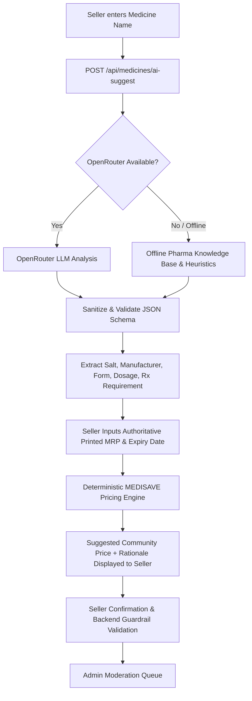
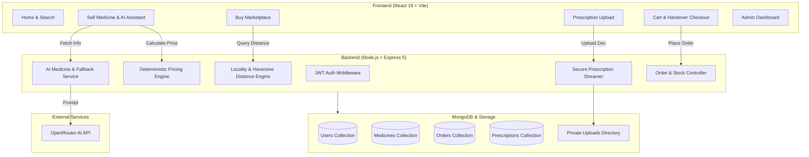

# MEDISAVE

> **A Verified Community Medicine Redistribution & Exchange Platform**  
> *A community-focused medicine reuse and redistribution prototype designed to help people safely exchange unused, unexpired eligible medicines within practical local handover zones.*

---

## ⚠️ Academic & Community Engagement Notice
**MEDISAVE is an academic and community engagement prototype.** It is **not** a commercial pharmacy, licensed drug manufacturer, or medical authority. The platform is designed for research, educational demonstrations, and community health pilot programs. Medicine redistributions require mutual in-person inspection and coordinator verification.

---

## 📋 Table of Contents
- [Problem Statement](#problem-statement)
- [Solution](#solution)
- [Key Features](#key-features)
- [Real-World Community Handover Model (Katraj vs Hinjewadi)](#real-world-community-handover-model-katraj-vs-hinjewadi)
- [Deterministic Fair Pricing Methodology](#deterministic-fair-pricing-methodology)
- [AI Architecture & OpenRouter Integration](#ai-architecture--openrouter-integration)
- [System Architecture](#system-architecture)
- [Technology Stack](#technology-stack)
- [Security & Access Control](#security--access-control)
- [Scalability: Current vs Future Architecture](#scalability-current-vs-future-architecture)
- [Production & Real-World Considerations](#production--real-world-considerations)
- [Installation & Local Setup](#installation--local-setup)
- [Environment Variables Guide](#environment-variables-guide)
- [Automated Testing & Verification Suite](#automated-testing--verification-suite)
- [Project Status: Implemented vs Future Scope](#project-status-implemented-vs-future-scope)
- [Community Engagement & College Campus Deployment](#community-engagement--college-campus-deployment)

---

## 🚨 Problem Statement
Every year, substantial quantities of unopened, unexpired pharmaceutical medications are discarded by households due to treatment course completions, dosage adjustments, or over-purchasing. Concurrently, underprivileged individuals and students face recurring healthcare expenses for common essential medications.

1. **Medicine Wastage**: Unused medicines frequently remain forgotten in homes until they expire and must be discarded into the environment.
2. **Healthcare Affordability**: Students and low-income community members often struggle with recurring pharmaceutical expenses.
3. **Safety & Compliance Hurdles**: Peer-to-peer medicine exchanges require rigorous verification of physical seal integrity, expiration buffers, and Schedule H prescription compliance.
4. **Logistical Distance Reality**: Arbitrary peer-to-peer delivery across a large metropolis (e.g. Katraj to Hinjewadi) is impractical without dedicated courier fleets.
5. **Pricing Inconsistency**: Peer-to-peer pricing requires fair, non-profit mathematical guardrails to prevent exploitation.

---

## 💡 Solution
**MEDISAVE** bridges healthcare affordability, safety compliance, and environmental responsibility through a verified community-driven platform:
1. **Donor / Seller Surplus Listings**: Facilitates the listing of unopened, sealed surplus blister strips or bottles.
2. **Deterministic Quality & Expiry Enforcement**: Automatically rejects medicines with less than 90 days of shelf life and requires intact packaging.
3. **Transparent Fair Community Pricing**: Suggests non-profit community prices derived strictly from the seller's verified printed MRP, packaging condition, and remaining shelf life.
4. **AI-Assisted Medicine Normalization**: Employs OpenRouter AI (with instant offline pharmaceutical knowledge base fallback) to identify salt formulations, manufacturers, strengths, and prescription classes.
5. **Prescription Safety Verification**: Mandates coordinator review and approval for Schedule H/H1 medications before checkout is permitted.
6. **Locality-Based Community Handover**: Implements a transparent locality model across Pune with deterministic Haversine distance calculations and public landmark handovers.

---

## 🌟 Key Features

### 1. Community Marketplace
- Search by brand name, active salt, or therapeutic category.
- Filter by category, dosage form, prescription requirement, and maximum price.
- **"Nearby First (Closest Handover)" Sorting**: Computes spherical Haversine distance from the buyer's selected locality.
- Proximity tier badges: `Nearby (0–5 km)`, `Extended area (5–15 km)`, and `Far from you (>15 km)`.

### 2. Seller Listing with Smart Assistance
- Real-time **MEDISAVE Suggested Community Price** with transparent mathematical rationales.
- AI autofill for active salt composition, manufacturer, dosage form, and packaging standards.
- Pune locality selection with auto-suggested landmarks (e.g. College Main Gate, Metro Station).

### 3. Prescription Upload & Verification Workflow
- Multi-format upload (PDF, JPG, PNG under 5 MB) for Schedule H/H1 medications.
- Coordinator review dashboard with approval, expiration tagging, and detailed rejection tracking.
- Secure, authenticated streaming of prescription documents (never served via public static URLs).

### 4. Cart & Multi-Seller Checkout
- Supports ordering items from multiple community sellers in a single checkout.
- Atomic stock decrements and self-purchase prevention.
- Explicit Community Handover preference selection (`Agreed Public Point` vs `Nearby Direct Handover`).

### 5. Admin Moderation & Oversight
- Medicine listing moderation queue (Approve, Reject with reason, or Remove).
- Prescription verification queue with patient identification.
- Community exchange statistics and inventory auditing.

---

## 📍 Real-World Community Handover Model (Katraj vs Hinjewadi)

### The Problem & Solution
MEDISAVE is a **community medicine redistribution platform, NOT a commercial logistics company**. The platform does **not** claim to operate an internal delivery fleet across Pune.

Instead, MEDISAVE implements a deterministic locality-based community matching system:
- **Seller Profile**: Specifies Pune locality (e.g., *Katraj*), PIN code (*411046*), preferred public handover point (e.g., *College Gate*), and optional radius.
- **Buyer Selection**: Chooses their current locality (e.g., *Hinjewadi* or *Katraj*).
- **Deterministic Proximity Classification**:
  $$\text{Haversine Distance}(Katraj, Hinjewadi) \approx 20.4\text{ km} \implies \text{"Far from you · 20.4 km"}$$
  $$\text{Haversine Distance}(Katraj, Bibvewadi) \approx 2.1\text{ km} \implies \text{"Nearby · 2.1 km"}$$
  $$\text{Haversine Distance}(Kothrud, Baner) \approx 6.1\text{ km} \implies \text{"Extended area · 6.1 km"}$$
- **Marketplace Behavior**: Nearby listings are prioritized at the top of the marketplace when sorted by *"Nearby First"*, while distant listings remain transparently visible with distance warnings.

```
+-----------------------------------------------------------------------------------+
|  "MEDISAVE is designed for community-based handover. Buyers and sellers agree on  |
|  a convenient handover point. MEDISAVE does not currently operate its own         |
|  delivery network."                                                               |
+-----------------------------------------------------------------------------------+
```

---

## 💰 Deterministic Fair Pricing Methodology

### Authoritative Printed MRP + Policy Guardrails
AI is **never** the final authority on pharmaceutical pricing. In MEDISAVE, the **physical printed MRP** entered by the seller is authoritative. The system applies deterministic mathematical guardrails:

$$\text{Suggested Community Price} = \operatorname{round}\left(P_{\text{MRP}} \times M_{\text{expiry}} \times M_{\text{condition}}\right)$$

### Pricing Brackets
| Remaining Shelf Life | Condition | Pricing Multiplier | Effective Community Discount |
| :--- | :--- | :--- | :--- |
| **$> 12\text{ months}$** | Sealed Blister / Bottle | $0.60$ | **40% Off** |
| **$6 - 12\text{ months}$** | Sealed Blister / Bottle | $0.50$ | **50% Off** |
| **$3 - 6\text{ months}$** | Sealed Blister / Bottle | $0.35$ | **65% Off** |
| **$< 90\text{ days}$ ($< 3\text{ months}$)** | Any | *Ineligible* | **Rejected by Safety Policy** |

### Hard Backend Pricing Cap
To prevent profiteering on donated/surplus medicines, the backend strictly rejects any listing where:
$$\text{Offered Price} > 0.85 \times P_{\text{MRP}}$$

---

## 🤖 AI Architecture & OpenRouter Integration

OpenRouter AI acts as an **intelligent assistant** to normalize pharmaceutical terms and suggest baseline parameters, while deterministic backend services validate all inputs.



### Supported Fallback Test Cases
The built-in offline pharmaceutical engine handles key medications seamlessly even if network connectivity or OpenRouter is unavailable:
- **Dolo 650** (*Paracetamol IP 650mg* - OTC)
- **Dolomide** (*Paracetamol 500mg + Domperidone 10mg* - OTC)
- **Augmentin 625 Duo** (*Amoxicillin 500mg + Clavulanate 125mg* - Rx Required)
- **Pantocid 40** (*Pantoprazole Sodium 40mg* - Rx Required)
- **Pan-D** (*Pantoprazole 40mg + Domperidone 30mg SR* - Rx Required)
- **Shelcal 500** (*Calcium Carbonate 500mg + Vitamin D3* - OTC)
- **Azee 500** (*Azithromycin 500mg* - Rx Required)

---

## 🏗️ System Architecture



---

## 🛠️ Technology Stack

| Layer | Technologies |
| :--- | :--- |
| **Frontend** | React 19, Vite, TailwindCSS (Vanilla CSS tokens), React Router v7, Lucide Icons, Axios |
| **Backend** | Node.js, Express 5, Mongoose 8, JWT, Multer, Bcrypt |
| **Database** | MongoDB (Local development / MongoDB Atlas) |
| **AI Layer** | OpenRouter API (Gemini 2.0 Flash / LLaMA / Claude) + internal heuristic fallback |
| **Testing** | Node.js Native Assertion Integration Test Suites |

---

## 🔒 Security & Access Control

1. **Role-Based Access Control (RBAC)**: Distinct permissions for `user` and `admin`. Normal users cannot access admin endpoints (`/api/admin/*`).
2. **Prescription Ownership & IDOR Protection**: Prescriptions are strictly bound to the authenticated user's JWT ID. Users cannot view, modify, or stream another buyer's prescription document.
3. **Private Document Storage**: Prescription documents are stored outside public web roots and streamed securely via authenticated Express endpoints with path traversal protection.
4. **Server-Side Validation**: All pricing calculations, stock adjustments, and Schedule H prescription requirements are strictly enforced on the server; client-side price/stock tampering is rejected.
5. **No Tracked Secrets**: Environment variables (`.env`) are strictly ignored via `.gitignore` with templates provided in `.env.example`.

---

## 📈 Scalability: Current vs Future Architecture

| Dimension | Current Implementation (MVP) | Planned Future Architecture |
| :--- | :--- | :--- |
| **API Architecture** | Stateless Express.js REST API | Distributed microservices / serverless functions |
| **Database & Indexing** | Indexed MongoDB collections (text, locality, status) | Read-replicas, sharded cluster, Redis caching layer |
| **Document Storage** | Local isolated storage with authenticated streaming | Cloud Object Storage (AWS S3 / GCP Cloud Storage) with signed URLs |
| **Static Assets** | Local Vite bundle distribution | Global Content Delivery Network (Cloudflare / CloudFront) |
| **Geographic Partitioning**| Curated 18-locality Pune registry (Haversine calculation) | Dynamic PostGIS / GeoJSON geo-fencing across multiple cities |
| **Logistics** | Mutual public point community handover | Integration with verified student couriers / local logistics partners |

---

## ⚖️ Production & Real-World Considerations

Deploying MEDISAVE beyond an academic/community pilot requires addressing critical operational and regulatory requirements:
1. **Medical & Regulatory Compliance**: Legal alignment with national drug controller regulations governing surplus pharmaceutical redistributions.
2. **Identity Verification**: Multi-factor identity verification (KYC/DigiLocker) for donors listing prescription medications.
3. **Cloud Object Storage**: Transitioning document uploads from local disk to HIPAA/SOC-2 compliant encrypted object storage.
4. **Production Monitoring**: Integrating structured logging (Winston/Pino), APM (Datadog/Sentry), and API rate limiting (express-rate-limit).
5. **Cold-Chain & Storage Verification**: Strict exclusion of temperature-sensitive biologics/insulins requiring refrigerated cold-chain storage.

---

## 🚀 Installation & Local Setup

### Prerequisites
- Node.js (v18 or higher)
- MongoDB running locally on `mongodb://127.0.0.1:27017` (or MongoDB Atlas connection string)
- Git

### 1. Clone & Setup Backend
```bash
# Navigate to backend directory
cd backend

# Install dependencies
npm install

# Create environment configuration
cp .env.example .env

# Start backend server
npm run dev
```
*Backend runs on `http://localhost:5000`*

### 2. Setup Frontend
```bash
# In a new terminal, navigate to frontend directory
cd frontend

# Install dependencies
npm install

# Create environment configuration
cp .env.example .env

# Start frontend development server
npm run dev
```
*Frontend runs on `http://localhost:5173`*

---

## ⚙️ Environment Variables Guide

### Backend (`backend/.env`)
```env
# Server Port
PORT=5000

# MongoDB URI (Local or Atlas)
MONGO_URI=mongodb://127.0.0.1:27017/medisave

# JWT Secret Key for token signing
JWT_SECRET=your_jwt_secret_key_change_in_production

# OpenRouter AI API Key (Optional for offline fallback)
OPENROUTER_API_KEY=your_openrouter_api_key_here

# OpenRouter Model Identifier
OPENROUTER_MODEL=google/gemini-2.0-flash-001
```

### Frontend (`frontend/.env`)
```env
# Backend REST API endpoint
VITE_API_URL=http://localhost:5000/api
```

---

## 🧪 Automated Testing & Verification Suite

MEDISAVE contains an automated integration test suite located in `scratch/`. All test suites have been executed and verified:

```bash
# Run Locality & Pricing Tests
node scratch/test_locality_and_pricing.js

# Run AI Medicine & Fallback Verification
node scratch/verify_all_ai_cases.js

# Run Full Cart + Multi-Seller Order E2E Tests
node scratch/test_full_cart_order_e2e.js

# Run Admin Moderation Tests
node scratch/test_admin_moderation.js

# Run Prescription Upload & Security Tests
node scratch/test_prescription_checkout_security.js
```

### Verified Test Results Summary
- ✅ **Locality & Distance Engine**: Katraj vs Hinjewadi correctly classified as `Far from you · 20.4 km`; Katraj vs Bibvewadi classified as `Nearby · 2.1 km`.
- ✅ **Deterministic Pricing Policy**: Verified $>12$ mo (40% discount), $6-12$ mo (50% discount), $3-6$ mo (65% discount), $<90$ day rejection, and 85% MRP cap enforcement.
- ✅ **Pharma Knowledge Base & AI**: 12/12 pharmaceutical test cases verified with fallback resilience.
- ✅ **Prescription & Checkout Security**: 49/49 security assertions passed (IDOR defense, tamper immunity, RBAC).
- ✅ **Frontend Build & Linting**: ESLint clean (0 errors, 0 warnings); production build successful.

---

## 📊 Prototype Status, Limitations & Future Deployment

### Current Prototype

MEDISAVE currently demonstrates:

* verified community members
* medicine listing moderation
* expiry validation
* locality-based matching
* deterministic community pricing
* AI-assisted medicine information
* prescription verification
* secure prescription access
* order and handover workflow

### Current Limitations

* Geographic distance is currently used rather than live road routing.
* MEDISAVE does not operate its own delivery fleet.
* Prescription verification is an administrative workflow and should be handled by appropriately qualified personnel in a real deployment.
* Medicine redistribution would require compliance with applicable Indian pharmaceutical regulations before real-world operation.
* AI-generated medicine information requires seller/user confirmation.

### Future Deployment

Potential future integrations:

* community/NGO collection points
* licensed pharmacy/healthcare partners
* external logistics providers
* geospatial/road-distance services
* OCR for batch and expiry verification
* stronger identity verification
* production cloud storage and monitoring

Do not claim these future features already exist.

---

## 🤝 Community Engagement & College Campus Deployment

MEDISAVE is structured for straightforward pilot deployment across university campuses and local residential welfare associations (RWAs):

1. **Campus Handover Hubs**: Designating secure public spots (e.g., *Campus Medical Room*, *Student Council Desk*, *Hostel Gate*) as verified handover points.
2. **Student Health Volunteers**: Senior pharmacy or biology students acting as peer moderators to inspect physical seal integrity before release.
3. **Medical Waste Reduction Drives**: Periodic campus awareness drives where students and faculty can register unopened surplus medications instead of discarding them into household trash.

---

## 📄 License & Academic Attribution
This project is developed as an academic and community engagement initiative. Recommended license for open-source academic dissemination: **MIT License**.
