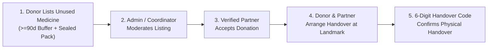
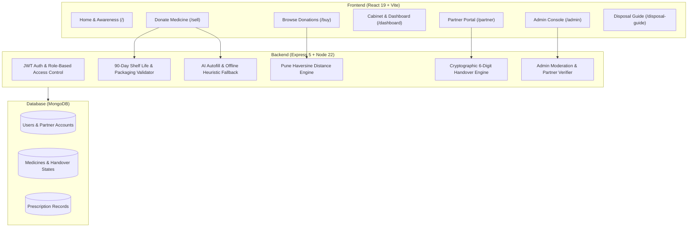

# MEDISAVE

### Verified Community Medicine Donation & Expiry Awareness Platform

> **A Community Engagement Project (CEP) Prototype developed at Pune Institute of Computer Technology (PICT), Pune.**  
> Course: Community Engagement Project (CEP | Course Code: 0313201)  
> Department of Computer Engineering | Academic Year 2026-27

---

## ⚠️ Academic Prototype & Community Notice

**MEDISAVE is an academic Community Engagement Project developed by second-year engineering students at PICT.**

> **Important Disclaimer**: MEDISAVE is an academic prototype and does NOT authorize commercial pharmacy dispensing or retail drug sales. It intentionally avoids peer-to-peer commercial medicine trading and provides a structured digital workflow for verified community surplus donation, coordinator moderation, accredited partner redistribution, and safe disposal education.

---

## 1. Problem Statement

Substantial quantities of unexpired, factory-sealed medicines accumulate in household cabinets due to recovery from acute conditions, dosage changes, or over-purchasing. These medicines typically sit unused until they pass their expiry dates and are discarded into domestic waste.

1. **Pharmaceutical Wastage**: Usable surplus medicines are lost while low-income community members and charitable clinics face supply gaps for essential drugs.
2. **Environmental & Water Hazard**: Flushing or throwing expired medications into domestic garbage pollutes local water bodies (such as Pune's Mula-Mutha basin) and accelerates antimicrobial resistance (AMR).
3. **Risks of Unverified Distribution**: Informal peer-to-peer medicine sharing without coordinator verification risks circulating expired, damaged, or controlled substances.
4. **Logistical Constraints**: Community initiatives cannot rely on commercial delivery fleets; physical exchanges require localized, safe handover points at known public landmarks.

---

## 2. Proposed Solution

**MEDISAVE** bridges community donors with accredited partner organizations (charitable dispensaries, community clinics, and NGOs) through an authenticated redistribution workflow:

- **Strict Intake Filters**: Enforces minimum 90-day remaining shelf-life, intact blister packaging, and domestic storage validation before listing.
- **Coordinator Moderation**: Requires admin review of packaging photos, batch details, and expiry dates before listings become visible.
- **Accredited Partner Distribution**: Only verified healthcare partners can browse, claim, and redistribute available donations.
- **Physical Handover Authentication**: A server-generated 6-digit one-time code (OTP) confirms that donor and partner met in person and verified packaging integrity.
- **Safe Household Disposal Guidance**: Expired or ineligible medicines are automatically routed to safe disposal protocols rather than redistribution.

---

## 3. How MEDISAVE Works



1. **Donor Lists Unused Eligible Medicine**: The donor enters the medicine name (assisted by AI metadata autofill), printed batch number, expiration date, and packaging condition.
2. **Admin Verifies & Moderates**: A platform coordinator audits the submission against safety guidelines and approves or rejects it with an audit explanation.
3. **Verified Partner Accepts**: An accredited partner clinic reviews nearby donations (sorted by Haversine distance) and accepts the item.
4. **Donor & Partner Arrange Approved Handover**: Both parties coordinate a physical meeting at a designated public landmark (e.g., *Vanaz Metro Station*, *Katraj Chowk PMT Stop*).
5. **6-Digit Handover Code Confirms Completion**: The donor provides their private 6-digit OTP in person. The partner enters the code in the Partner Portal to inspect and complete the handover.

---

## 4. Main Features

- **Medicine Cabinet Tracker**: Color-coded household medicine shelf-life tracker (Green `>6m`, Amber `3–6m`, Red `<3m`/Expired) with 1-click donation or disposal routing.
- **AI-Assisted Intake Form**: OpenRouter AI (with offline pharmaceutical heuristics fallback) auto-fills generic name, strength, category, and storage requirements.
- **Proximity-Based Discovery**: Deterministic Haversine distance calculation between 18 Pune localities, categorizing handovers as *Nearby* ($\le 5\text{ km}$), *Moderate* ($5–15\text{ km}$), or *Distant* ($> 15\text{ km}$).
- **Partner Redistribution Portal**: Dedicated dashboard for verified clinics to browse available donations, manage active handovers, and record redistribution.
- **Admin Moderation Console**: Real-time platform statistics, pending listing approval queue, and partner verification management.
- **Safe Disposal & Green Healthcare Guide**: Educational module outlining WHO/CPCB-compliant household medicine disposal steps and prototype Pune drop-off locations.

---

## 5. User Roles & Access Control

| Role | Access Route | Permissions & Capabilities |
| :--- | :--- | :--- |
| **Donor (`user`)** | `/dashboard`, `/sell` | • Log household medicines in Cabinet Tracker<br>• List eligible surplus donations with AI assistance<br>• View private 6-digit handover OTP upon partner acceptance<br>• Access Safe Disposal Guide |
| **Verified Partner (`partner`)** | `/partner` | • Browse approved donations sorted by Pune proximity<br>• Accept surplus items for community redistribution<br>• Enter donor's 6-digit OTP during physical handover to complete transfer<br>• Reject/release donations with reason if unsuitable |
| **Coordinator / Admin (`admin`)** | `/admin` | • Audit, approve, or reject pending medicine listings<br>• Verify or reject registered partner organizations (`partnerStatus: "verified"`)<br>• Review Schedule H medical prescriptions<br>• Monitor platform audit logs and metrics |

---

## 6. Safety Guardrails

- **90-Day Minimum Shelf-Life**: The backend strictly rejects any donation listing expiring in $<90$ days (`daysRemaining < 90`).
- **Sealed / Intact Packaging Requirement**: Only intact sealed blister strips, factory-sealed boxes, and unopened foil sachets are eligible. Cut strips or unsealed containers are rejected.
- **Cold-Chain Medicine Exclusion**: Medications requiring continuous refrigeration ($2^\circ\text{C} - 8^\circ\text{C}$, e.g., insulin) are excluded from community handover due to domestic storage risks.
- **Schedule X Narcotics Prohibition**: Habit-forming controlled substances are strictly prohibited from listing.
- **Prescription Verification (Schedule H/H1)**: Prescription drugs require doctor prescription verification before redistribution.
- **Brute-Force Handover Lockout**: Handover verification is permanently locked after 5 consecutive incorrect code entries to prevent guessing attacks.
- **Safe Disposal Redirection**: Ineligible or expired medicines are directed to safe neutralization and disposal guidance.

---

## 7. Technology Stack

| Layer | Technologies Used |
| :--- | :--- |
| **Frontend UI** | React 19, Vite 8, TailwindCSS 4, React Router 7 |
| **Backend API** | Node.js 22, Express.js 5, REST Architecture |
| **Database** | MongoDB 8, Mongoose ODM |
| **Authentication** | JWT (JSON Web Tokens), Bcrypt Password Hashing, RBAC Middleware |
| **AI Intake Engine** | OpenRouter API (Gemini 2.0 Flash) with Offline Pharmaceutical Heuristics Fallback |
| **Testing** | ESLint 10, Vite Production Bundler, Custom Automated Assertion Suites |

---

## 8. System Architecture



---

## 9. Testing & Quality Assurance

MEDISAVE includes a comprehensive automated test suite covering all critical safety and workflow paths:

```bash
# 1. Run frontend linting (0 errors, 0 warnings)
cd frontend && npm run lint

# 2. Run frontend production build
cd frontend && npm run build

# 3. Run full pre-presentation integration audit
node scratch/run_pre_presentation_audit.js

# 4. Run 18-point comprehensive donation flow suite
node scratch/test_comprehensive_cep_flow.js

# 5. Run admin moderation test suite
node scratch/test_admin_moderation.js

# 6. Run prescription & security test suite
node scratch/test_prescription_checkout_security.js
```

### Verified Test Results Summary
- ✅ **Frontend Quality (`npm run lint`)**: 0 errors, 0 warnings.
- ✅ **Frontend Build (`npm run build`)**: Vite production bundle compiled cleanly in $<1\text{s}$.
- ✅ **System Audit (`run_pre_presentation_audit.js`)**: 28/28 tests passed (100%).
- ✅ **CEP Workflow Suite (`test_comprehensive_cep_flow.js`)**: 18/18 tests passed (100%).
- ✅ **Admin Moderation Suite (`test_admin_moderation.js`)**: 27/27 tests passed (100%).
- ✅ **Prescription & Security Suite (`test_prescription_checkout_security.js`)**: 49/49 tests passed (100%).
- **Total Automated Assertions**: **122 / 122 Passed (100%)**.

---

## 10. Local Setup & Installation

### Prerequisites
- Node.js (v18 or higher)
- MongoDB running locally on `mongodb://127.0.0.1:27017` (or MongoDB Atlas connection string)
- Git

### 1. Setup Backend
```bash
cd backend
npm install
cp .env.example .env
npm start
```
*Backend runs on `http://localhost:5000`*

### 2. Setup Frontend
```bash
cd frontend
npm install
cp .env.example .env
npm run dev
```
*Frontend runs on `http://localhost:5173`*

---

## 11. Environment Variables

### Backend Configuration (`backend/.env`)
```env
PORT=5000
MONGO_URI=mongodb://127.0.0.1:27017/medisave
JWT_SECRET=your_jwt_secret_key_change_in_production
OPENROUTER_API_KEY=your_openrouter_api_key_here
OPENROUTER_MODEL=google/gemini-2.0-flash-001
```

### Frontend Configuration (`frontend/.env`)
```env
VITE_API_URL=http://localhost:5000/api
```

---

## 12. Demo Accounts (Pre-Seeded for Evaluation)

The application includes pre-seeded demonstration accounts:

| Role | Email | Password | Intended Workflow |
| :--- | :--- | :--- | :--- |
| **Community Donor** | `community.donor@medisave.org` | `donor123` | Log cabinet items, submit donation listings, view 6-digit OTP |
| **Verified Partner** | `partner@medisave.org` | `partner123` | Browse nearby donations, claim items, enter handover OTP |
| **Coordinator / Admin** | `admin@medisave.org` | `admin123` | Approve listings, verify partner registrations, view stats |

---

## 13. CEP Alignment

* **Course**: Community Engagement Project (CEP - Course Code: 0313201)
* **Institution**: SCTR's Pune Institute of Computer Technology (PICT), Pune
* **Department**: Department of Computer Engineering
* **Division / Batch**: SY 2 | Batch H2
* **Team Members**:
  * **Ronit Subhedar** — Roll No. 21270
  * **Vidyang Wagh** — Roll No. 21282
  * **Darshan Solanke** — Roll No. 21269
  * **Sumukh Bhat** — Roll No. 21271

---

## 14. Field Study / Community Engagement Evidence

> **Academic Notice**: *To be completed from actual field-study evidence.*

The software platform serves as the technical prototype developed during the CEP semester. Empirical student survey findings, physical first-aid box audits, awareness drive photographs, and formal faculty mentor evaluations are documented in the physical project logbook, presentation deck, and departmental submission report.

---

## 15. Future Scope

- **Licensed Pharmacy Depots**: Integrating authorized retail pharmacy collection bins across Pune municipal wards.
- **Barcode & GS1 DataMatrix Scanning**: Direct camera scanning of packaging 2D barcodes for automated batch and expiry extraction.
- **Institutional NGO Portal Integration**: Automated inventory synchronization with partner charitable clinics and dispensaries.
- **Formal Regulatory Sandbox**: Exploring compliant deployment frameworks under state public health and bio-medical waste guidelines.

---

## 📄 License
This project is developed as an academic community engagement initiative at PICT under the MIT License.
